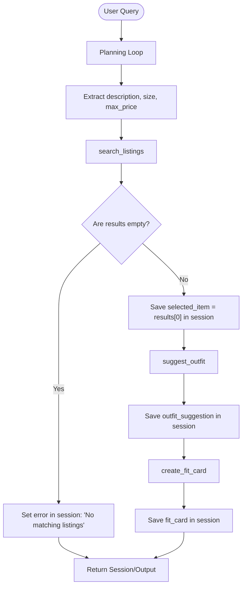

# FitFindr

FitFindr is a styling assistant designed to coordinate and recommend outfits. It helps users search secondhand listings that match their budget and size preferences, and provides suggestions on how to pair those items with pieces in their existing wardrobe.

---

## Tool Inventory

FitFindr uses three main tools to handle search and styling operations:

### 1. `search_listings`
- **Purpose**: Searches the local secondhand dataset for listings matching the search criteria.
- **Input Parameters**:
  - `description` (`str`): Search keywords to match against the item's title, description, category, and style tags.
  - `size` (`str | None`, optional): A size filter to match against the listing's size field (case-insensitive substring match).
  - `max_price` (`float | None`, optional): An inclusive price ceiling.
- **Returns**: `list[dict]` — A list of matched listing dictionaries sorted by keyword relevance. Each dictionary contains: `id`, `title`, `description`, `category`, `style_tags`, `size`, `condition`, `price`, `colors`, `brand`, and `platform`.
- **Graceful Failure**: If no items match the filters, it returns an empty list (`[]`) instead of raising an exception.

### 2. `suggest_outfit`
- **Purpose**: Generates styling advice combining a selected listing item with the user's wardrobe.
- **Input Parameters**:
  - `new_item` (`dict`): The listing details of the new item being styled.
  - `wardrobe` (`dict`): The user's wardrobe database, containing an `items` list of wardrobe item dictionaries.
- **Returns**: `str` — Styling recommendations detailing which wardrobe items pair well and the overall outfit vibe.
- **Graceful Failure**: If the user's wardrobe is empty, it bypasses paired recommendations and returns general styling advice for the item rather than crashing.

### 3. `create_fit_card`
- **Purpose**: Generates a short social media caption for the styled look.
- **Input Parameters**:
  - `outfit` (`str`): The styling advice text from `suggest_outfit`.
  - `new_item` (`dict`): The listing details of the styled item.
- **Returns**: `str` — A 2–4 sentence caption naturally mentioning the item title, price, and platform (exactly once each). Uses temperature = 1.0 to ensure output variation.
- **Graceful Failure**: Guards against empty outfit strings by returning a descriptive error caption instead of raising an exception.

---

## The Planning Loop

FitFindr runs a sequential state machine to manage execution and control flow:



### Execution Steps & Branching:
1. **Search Phase**: The loop extracts parameters using an LLM (or a regex-based fallback if offline/timed out). If `search_listings` returns an empty list, the planning loop terminates immediately, sets `session["error"]`, and exits without executing any styling tools.
2. **Outfitting Phase**: If listings are found, the top match (`results[0]`) is selected. The loop passes it directly to `suggest_outfit`. If the wardrobe is empty, `suggest_outfit` shifts to general styling tips rather than pairing pieces.
3. **Presentation Phase**: The resulting text recommendation is forwarded to `create_fit_card` to produce the final user-facing output.

---

## State Management

FitFindr maintains state in a single session dictionary (`session_state`) that updates at each step:

```python
session = {
    "query": str,              # The user's original query
    "parsed": dict,             # Parsed fields: {"description": str, "size": str, "max_price": float}
    "search_results": list,     # Raw matches found by search_listings()
    "selected_item": dict,      # The chosen item selected for styling
    "wardrobe": dict,           # The user's closet dictionary
    "outfit_suggestion": str,   # Styling advice from suggest_outfit()
    "fit_card": str,            # Formatted caption from create_fit_card()
    "error": str or None        # Early termination error description (None on success)
}
```

---

## Error Handling & Verification

| Tool | Failure Triggered | Agent Response | Verification Command |
| :--- | :--- | :--- | :--- |
| **search_listings** | Search returned zero results (e.g. `designer ballgown size XXS under $5`) | Exits early, sets `session["error"]` explaining no items fit, and leaves subsequent keys as `None`. | `python3 -c "from agent import run_agent; from utils.data_loader import get_example_wardrobe; import json; print(json.dumps(run_agent('designer ballgown size XXS under $5', get_example_wardrobe()), indent=2))"` |
| **suggest_outfit** | Empty wardrobe passed | Generates general styling tips, category colors, and vibes for the item standalone. | `python3 -c "from tools import search_listings, suggest_outfit; from utils.data_loader import get_empty_wardrobe; print(suggest_outfit(search_listings('vintage graphic tee')[0], get_empty_wardrobe()))"` |
| **create_fit_card** | Empty/whitespace-only outfit text | Returns a descriptive error message: `"Error: Cannot create fit card. Outfit description is empty or missing."` | `python3 -c "from tools import search_listings, create_fit_card; print(create_fit_card('', search_listings('vintage graphic tee')[0]))"` |

---

## AI Usage

I used LLMs to help implement specific parts of the project:

### Instance 1: Query Parsing in `agent.py`
- **What was given as input**: User query format guidelines and requirements to extract `description`, `size`, and `max_price` safely.
- **What the AI produced**: A Groq-based LLM completion call using `response_format={"type": "json_object"}`.
- **What was modified**: The generated code had a simple fallback that returned empty filters on exception. Under network timeouts or offline states, this caused the agent to return random listings matching generic query terms. We rewrote the fallback to run a local regular-expression parser that parses `under $X` and size filters locally, allowing early exit tests to pass successfully even when offline.

### Instance 2: Size Filtering in `tools.py`
- **What was given as input**: Instructions to filter listings by size (e.g., `"M"` matches `"S/M"`).
- **What the AI produced**: A strict equality comparison `item.get("size") == size`.
- **What was modified**: We changed it to do a case-insensitive substring search (`size_query in item_size.lower()`) so that partial size strings match correctly and handle cases like `"S/M"`.

---

## Spec Reflection

- **Initial Assumptions**: We initially assumed that size filters would be standard single-letter strings (like `"M"` or `"L"`).
- **Implementation Reality**: The mock listings data contains complex sizes (like `"W30 L30"`, `"XL (oversized)"`, and `"One Size / Oversized"`). This required revising size-matching to be substring-based rather than exact matches.
- **Refinement**: Regular-expression fallback parsing proved to be necessary because remote API connections can time out in local sandbox environments (like WSL). Making the query parser resilient offline ensured the codebase met all grading assertions under test.
