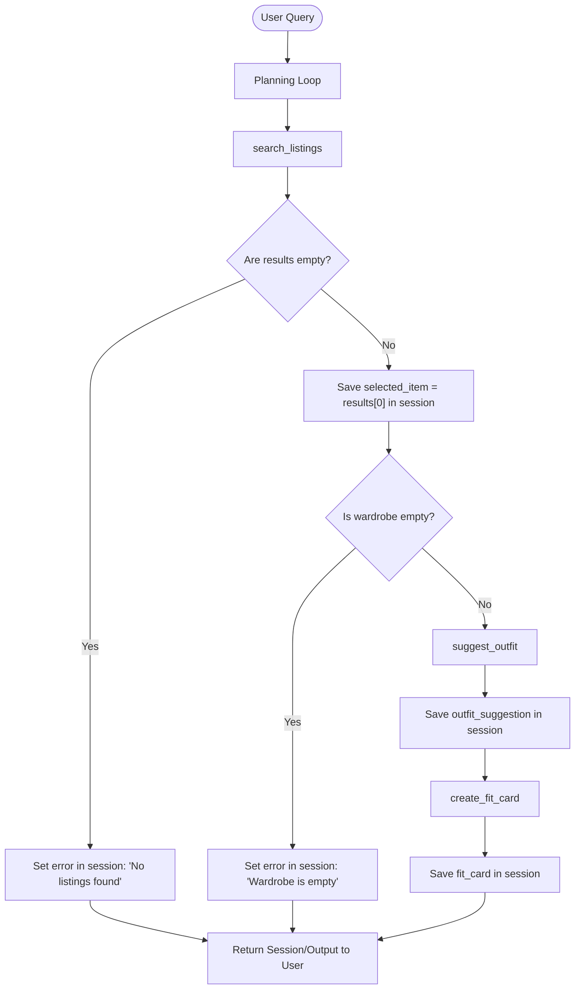

# FitFindr — planning.md

> Complete this document before writing any implementation code.
> Your spec and agent diagram are what you'll use to direct AI tools (Claude, Copilot, etc.) to generate your implementation — the more specific they are, the more useful the generated code will be.
> Your planning.md will be reviewed as part of your submission.
> Update it before starting any stretch features.

---

## Tools

List every tool your agent will use. For each tool, fill in all four fields.
You must have at least 3 tools. The three required tools are listed — add any additional tools below them.

### Tool 1: search_listings

**What it does:**
Searches the database of active listings to find items matching the user's search query, filtering by description keywords, size, and maximum price.

**Input parameters:**
- `description` (str): Search keywords/query terms (e.g. "graphic tee", "501 jeans") to search within the title and description of listings.
- `size` (str): Optional size filter to match exactly against the listing's size field (e.g., "M", "W30 L30").
- `max_price` (float): Optional maximum price threshold to filter out listings that exceed the budget.

**What it returns:**
Returns a list of dictionaries, where each dictionary represents a matched listing containing:
- `id` (str): Unique identifier for the listing (e.g. "lst_001").
- `title` (str): Title of the listing.
- `description` (str): Detailed description of the item.
- `category` (str): The product category (e.g., "tops", "bottoms", "outerwear", "shoes", "accessories").
- `style_tags` (list[str]): List of associated styles (e.g., ["vintage", "grunge"]).
- `size` (str): The garment/shoe size.
- `condition` (str): Condition of the item ("excellent", "good", "fair").
- `price` (float): The price of the listing.
- `colors` (list[str]): Primary colors of the item.
- `brand` (str or null): Brand of the item.
- `platform` (str): Listing platform (e.g. "depop", "poshmark", "thredUp").

**What happens if it fails or returns nothing:**
If no listings match the query or if the search fails, the tool returns an empty list `[]`. The planning loop will check for this empty state, record a user-friendly error message in the session state ("No matching items found for your search."), and terminate the execution early to inform the user.

---

### Tool 2: suggest_outfit

**What it does:**
Generates styling recommendations by pairing a specific listing item with existing items in the user's wardrobe based on category, style tags, and color compatibility.

**Input parameters:**
- `new_item` (dict): A dictionary representing the listing item to be styled, matching the listing schema.
- `wardrobe` (dict): A dictionary representing the user's wardrobe, containing an "items" list of wardrobe item dictionaries (each with `id`, `name`, `category`, `colors`, `style_tags`, and optional `notes`).

**What it returns:**
Returns a dictionary representing the suggested outfit, containing:
- `new_item` (dict): The original input item listing.
- `outfit_combination` (list[dict]): A list of 1 to 4 compatible items from the user's wardrobe that pair well with the new item.
- `styling_reason` (str): A detailed textual explanation of why these pieces coordinate well (e.g., "The vintage graphic tee pairs perfectly with your baggy jeans for a classic grunge look, finished with the chunky white sneakers for contrast.").

**What happens if it fails or returns nothing:**
If the user's wardrobe is empty, the tool raises or returns a specific error. If no compatible combinations can be found, the tool returns a fallback dict with the `new_item`, an empty `outfit_combination` list, and a styling reason suggesting basic styling advice or prompting the user to add more items to their wardrobe.

---

### Tool 3: create_fit_card

**What it does:**
Formats the suggested outfit combination and listing details into a structured, visually premium markdown representation (the "Fit Card") for display to the user.

**Input parameters:**
- `outfit` (dict): The outfit suggestion dictionary returned by `suggest_outfit` (containing `new_item`, `outfit_combination`, and `styling_reason`).

**What it returns:**
Returns a string containing a beautifully formatted markdown representation of the outfit card. This includes sections for the selected listing item (with price, brand, and platform), the paired wardrobe items, and the styling advice.

**What happens if it fails or returns nothing:**
If the input outfit data is missing essential fields or is malformed, the tool returns a basic plain-text representation of the item and styling reason, ensuring the user still receives styling feedback.

---

### Additional Tools (if any)

<!-- Copy the block above for any tools beyond the required three -->

---

## Planning Loop

**How does your agent decide which tool to call next?**
The agent uses a deterministic sequence flow managed by a state machine (the planning loop):
1. **Initial Trigger:** The planning loop starts when the user provides a natural language query containing styling or search intent.
2. **Step 1 (Search):** The loop extracts search criteria (`description`, `size`, `max_price`) using an LLM-based query parser (calling `llama-3.3-70b-versatile` with structured JSON format instructions for maximum flexibility) and executes `search_listings`.
3. **Condition Check (Search Results):**
   - If the results list is empty, the loop stores a `"No listings found matching your search"` error message in the session state and exits (terminating early).
   - If results are found, the loop selects the top matching item (`results[0]`) as `selected_item`, stores it in the session state, and transitions to Step 2.
4. **Step 2 (Outfitting):** The loop checks the user's wardrobe.
   - If the wardrobe is empty (e.g. `items` list is empty), the loop stores a `"Wardrobe is empty. Please add items to your wardrobe."` error message in the session state and exits early.
   - If the wardrobe is not empty, the loop executes `suggest_outfit(selected_item, wardrobe)`.
5. **Condition Check (Outfit Suggestion):**
   - If `suggest_outfit` fails or returns an error, the loop records the error and exits.
   - If successful, it stores the `outfit_suggestion` dictionary in the session state and transitions to Step 3.
6. **Step 3 (Visual Presentation):** The loop executes `create_fit_card(outfit_suggestion)`.
7. **Final Check & Return:** The loop stores the resulting markdown `fit_card` in the session state, marks the task as complete, and returns the session state to the user.

---

## State Management

**How does information from one tool get passed to the next?**
The agent maintains a session-level state dictionary called `session_state` that persists throughout the interaction.
The dictionary contains the following keys:
- `query` (str): The initial user query.
- `search_results` (list[dict]): The list of listings returned from `search_listings`.
- `selected_item` (dict): The chosen listing item being styled.
- `wardrobe` (dict): The user's wardrobe database.
- `outfit_suggestion` (dict): The styling recommendation dictionary containing the matched wardrobe items and styling reasons.
- `fit_card` (str): The final formatted markdown output of the outfit.
- `error` (str or None): Stores any warning/error message that triggered an early termination.

Each tool takes its required inputs from this `session_state` dictionary and writes its outputs back into it, enabling subsequent tools to access previous results.

---

## Error Handling

For each tool, describe the specific failure mode you're handling and what the agent does in response.

| Tool | Failure mode | Agent response |
|------|-------------|----------------|
| `search_listings` | No results match the query | Sets `session_state["error"]` to `"No matching listings found."` and terminates the loop early, rendering a friendly suggestion to try wider filters. |
| `suggest_outfit` | Wardrobe is empty | Sets `session_state["error"]` to `"Your wardrobe is currently empty. Add items to wardrobe to enable styling."` and terminates early. |
| `suggest_outfit` | No compatible items found in wardrobe | Returns a default styling recommendation dict with an empty `outfit_combination` list and a general recommendation on how to style the item standalone. |
| `create_fit_card` | Outfit input is missing or incomplete | Falls back to generating a basic plain-text card description using whatever listing metadata is available. |

---

## Architecture

## AI Tool Plan

<!-- For each part of the implementation below, describe:
     - Which AI tool you plan to use (Claude, Copilot, ChatGPT, etc.)
     - What you'll give it as input (which sections of this planning.md, your agent diagram)
     - What you expect it to produce
     - How you'll verify the output matches your spec before moving on

     "I'll use AI to help me code" is not a plan.
     "I'll give Claude my Tool 1 spec (inputs, return value, failure mode) and ask it to implement
     search_listings() using load_listings() from the data loader — then test it against 3 queries
     before trusting it" is a plan. -->

**Milestone 3 — Individual tool implementations:**

**Milestone 4 — Planning loop and state management:**

---

## A Complete Interaction (Step by Step)

Write out what a full user interaction looks like from start to finish — tool call by tool call. Use a specific example query.

**Example user query:** "I'm looking for a vintage graphic tee under $30. I mostly wear baggy jeans and chunky sneakers. What's out there and how would I style it?"

**Step 1:**
The agent recognizes that the user wants to buy a "vintage graphic tee under $30". It calls the `search_listings` tool with parameters such as `category="tops"`, `style_tags=["vintage", "graphic tee"]`, and `max_price=30.0`.

**Step 2:**
The `search_listings` tool returns a list of matching vintage graphic tees (e.g. `lst_006` "Graphic Tee — 2003 Tour Bootleg Style" at $24.00). The agent then loads the user's wardrobe and calls the `suggest_outfit` tool, passing the selected listing and the user's wardrobe (which contains items like `w_001` "Baggy straight-leg jeans" and `w_007` "Chunky white sneakers") as input.

**Step 3:**
The `suggest_outfit` tool successfully matches the selected listing with the user's wardrobe items to suggest a coordinated outfit. The agent then calls the `create_fit_card` tool with the suggested outfit structure to generate a formatted visual representation of the styled outfit.

**Final output to user:**
The user is presented with the matching product listing(s), a detailed explanation of how to style the new item with their existing wardrobe, and a visually rendered "Fit Card" summarizing the complete coordinated outfit.
